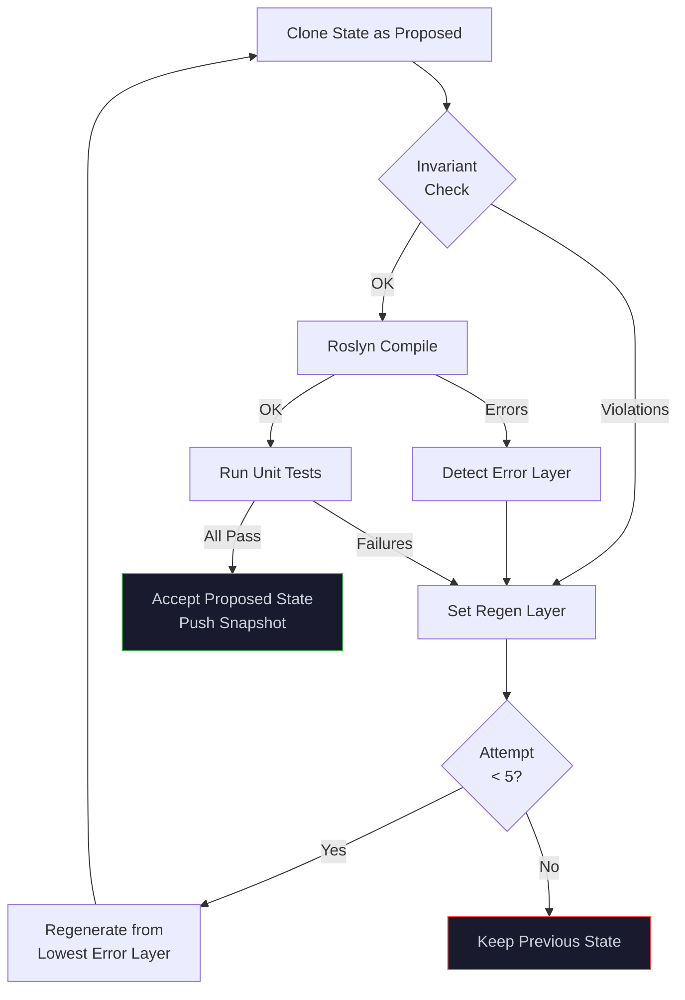

# Ψ PlatinumForge by WaveFunctionLabs

> **Describe what you want. The Design Council refines it. The Forge builds it.**

PlatinumForge is a single-file C# web application that uses LLM-driven autonomous software generation. Define your intent and constraints — a council of AI agents helps you refine the specification, then a 10-stage pipeline generates a multi-file project with interfaces, implementations, tests, infrastructure, and a published artifact.

No scaffolding. No boilerplate. Constraints in → working code out.

**Live:** [platinumforge.wavefunctionlabs.com](https://platinumforge.wavefunctionlabs.com)

---

## ✨ Key Features

- **🏛️ Design Council** — 6 specialised AI agents with distinct perspectives collaborate on your spec
- **10-stage Forge pipeline** — Manifest → Interfaces → Tests → Code → Build → NFR → Soak → Integration → IaC → Publish
- **Multi-file generation** — LLM plans a file manifest, then generates individual files (interfaces, services, controllers, models, enums, Program.cs, etc.)
- **Configurable pipeline** — Enable/disable any stage (Playwright, Locust, Jest, IaC, etc.)
- **Real-time progress** — Pipeline chevrons light up as stages run, with animated progress bar and elapsed timer
- **🏠 Hestia enrichment** — LLM-powered button on every section that deepens rough ideas into production specs
- **🧹 Dedupe** — LLM compaction that merges near-duplicate entries and normalises keys
- **📤 Export / 📥 Import** — Download/upload definitions as JSON for portability
- **Real-time collaboration** — SSE-based live sync across multiple browser tabs/users
- **Quality sliders** — 12 dials (performance, security, readability, etc.) that shape generated code style
- **Versioned builds** — Semver-tracked artifacts with full build history and download
- **Multi-provider OAuth** — Google, Microsoft, GitHub, Facebook, Apple (or open-access local mode)
- **Monaco editor** — Syntax-highlighted code viewer with multi-language support
- **Single file** — The entire application is one `Program.cs` (~5500 lines, no frameworks, no ASP.NET)

---

## 🏛️ Design Council — AI Agents

PlatinumForge features a council of 6 AI agents, each with a unique perspective. Select an agent in the chat panel and they respond in character, with full awareness of your project's materialised metadata.

| Agent | Role | Perspective |
|-------|------|-------------|
| **Ψ Psi** | General Designer | Balanced, helpful, opinionated — the default conversational agent |
| **☀️ Apollo** | The Expander | Broadens the wavefunction of possibility — wild ideas, lateral thinking, "what if?" |
| **🔥 Prometheus** | The Challenger | Questions and challenges requirements — probes assumptions, finds gaps |
| **⚒️ Hephaestus** | The Builder | Practical engineering — data structures, patterns, architecture, DI, pipelines |
| **⚖️ Themis** | The Enforcer | Enforces rules and consistency — blocks non-compliant changes, cross-references layers |
| **🏠 Hestia** | The Explorer | Enriches concepts in depth — splits compound ideas, adds missing considerations |

Every agent can propose **actions** (add/remove/update entries in any layer) that you can apply with one click.

---

## 🏗 Architecture

```
┌─────────────────────────────────────────────────────────────────────────┐
│                          Browser (SPA)                                  │
│  ┌──────────┐  ┌─────────────────────────┐  ┌────────────────────────┐ │
│  │Constraint│  │    Monaco Editor         │  │   Ψ Chat Panel         │ │
│  │  Editor  │  │  (Code/Tests/Store/Logs) │  │  Agent Tabs + Prompt   │ │
│  └────┬─────┘  └────────┬────────────────┘  └──────────┬─────────────┘ │
│       └─────────────────┼───────────────────────────────┘               │
│                         │ SSE + REST                                    │
└─────────────────────────┼──────────────────────────────────────────────┘
                          │
┌─────────────────────────┼──────────────────────────────────────────────┐
│              HttpListener (:5005)                                       │
│  ┌───────────┐ ┌───────────┐ ┌─────────────────────┐ ┌──────────────┐ │
│  │  Auth &   │ │  Session  │ │   Generation        │ │  Agent       │ │
│  │  Users    │ │  Manager  │ │   Pipeline          │ │  Router      │ │
│  └───────────┘ └───────────┘ └──────────┬──────────┘ └──────────────┘ │
│                                         │                              │
│  ┌──────────────────────────────────────┤                              │
│  │         Forge Engine                 │                              │
│  │  ┌─────────┐ ┌────────┐ ┌────────┐  │                              │
│  │  │ OpenAI  │ │ Roslyn │ │External│  │                              │
│  │  │ Client  │ │Compiler│ │Runners │  │                              │
│  │  └─────────┘ └────────┘ └────────┘  │                              │
│  └──────────────────────────────────────┘                              │
│                                                                        │
│  ┌────────────────────────────────────────────────────────────────────┐│
│  │  ~/.platinumforge/                                                 ││
│  │  ├── users/{sub}/sessions/{id}/store.json                         ││
│  │  ├── users/{sub}/builds.json                                      ││
│  │  ├── artifacts/{project}/{project}-v{ver}.zip                     ││
│  │  └── shares.json                                                  ││
│  └────────────────────────────────────────────────────────────────────┘│
└────────────────────────────────────────────────────────────────────────┘
```

---

## 🔄 Pipeline

PlatinumForge follows a 7-phase conceptual pipeline:

```
Intent → Constraints → Shape → Behaviour → Forge → Evolve → Commit
```

### Layer Model

| Phase | Layer | Description |
|-------|-------|-------------|
| **0 · Intent** | Description | What problem is being solved |
| | Personas | Actors interacting with the system |
| **1 · Constraints** | Rules | Design philosophy (pure functions, SRP, etc.) |
| | Invariants | Conditions that must always hold |
| **2 · Shape** | Architecture | System structure and decomposition |
| | Dataflow | Data movement and transformation |
| | Frameworks | Technology stack |
| | Language | Implementation language |
| | Deployment | Target environment (Azure, Docker, K8s, etc.) |
| **3 · Behaviour** | Features | System capabilities |
| | Stories | Functional requirements as flows |
| | NFR | Non-functional requirements |
| **Quality** | Sliders (0–100) | performance, latency, security, readability, simplicity, conciseness, ui-polish, test-coverage, error-handling, abstraction, layering, solid |

### Forge Pipeline (10 stages)

```mermaid
graph LR
    M[0. File Manifest] --> A[1. Interfaces]
    A --> B[2. Unit Tests]
    B --> C[3. Code]
    C --> D{4. Build & Test}
    D -->|Pass| E[5. NFR Tests<br/>Playwright]
    D -->|Fail ×5| C
    E --> F[6. Soak Tests<br/>Locust]
    F --> G[7. Integration Tests<br/>Jest]
    G --> H[8. Infrastructure<br/>Dockerfile, IaC]
    H --> I[9. Publish<br/>Versioned ZIP]

    style M fill:#1a1a2e,stroke:#3b82f6,color:#c9d1d9
    style A fill:#1a1a2e,stroke:#3b82f6,color:#c9d1d9
    style B fill:#1a1a2e,stroke:#3b82f6,color:#c9d1d9
    style C fill:#1a1a2e,stroke:#3b82f6,color:#c9d1d9
    style D fill:#1a1a2e,stroke:#60a5fa,color:#c9d1d9
    style E fill:#1a1a2e,stroke:#bc8cff,color:#c9d1d9
    style F fill:#1a1a2e,stroke:#bc8cff,color:#c9d1d9
    style G fill:#1a1a2e,stroke:#bc8cff,color:#c9d1d9
    style H fill:#1a1a2e,stroke:#bc8cff,color:#c9d1d9
    style I fill:#1a1a2e,stroke:#3fb950,color:#c9d1d9
```



**Stage 0 — File Manifest:** The LLM plans the project file structure before generating any code.

**Stages 1–3 — Multi-file generation:** Interfaces and code are generated as individual files (one per interface, one per service/controller/model) rather than monolithic blobs. The LLM uses path-prefixed filenames (e.g. `Services/UserService.cs`, `Controllers/HomeController.cs`).

**Stage 4 — Build & Test loop** retries up to 5 times with cascade regeneration. If a compilation error is detected in the test layer, it regenerates from tests upward. Only after unit tests pass do the external test stages run.

**Stages 5–8** are individually configurable (enable/disable in the Quality panel).

### Retry & Cascade Logic



---

## 🚀 Getting Started

### Prerequisites

- [.NET 10 SDK](https://dotnet.microsoft.com/download)
- An OpenAI API key (or compatible endpoint)

### Run

```bash
# Set your API key
export OPENAI_API_KEY="sk-..."

# Build and run
cd PlatinumForge
dotnet run
```

Open **http://localhost:5005** in your browser.

### Optional Configuration

| Environment Variable | Default | Description |
|---------------------|---------|-------------|
| `OPENAI_API_KEY` | *(required)* | OpenAI API key |
| `OPENAI_MODEL` | `gpt-4.1` | Model to use for generation |
| `OPENAI_ENDPOINT` | `https://api.openai.com/v1/chat/completions` | API endpoint |
| `GOOGLE_CLIENT_ID` | *(disabled)* | Google OAuth client ID |
| `GOOGLE_CLIENT_SECRET` | *(disabled)* | Google OAuth client secret |
| `MICROSOFT_CLIENT_ID` | *(disabled)* | Microsoft / Entra ID OAuth client ID |
| `MICROSOFT_CLIENT_SECRET` | *(disabled)* | Microsoft / Entra ID OAuth client secret |
| `GITHUB_CLIENT_ID` | *(disabled)* | GitHub OAuth App client ID |
| `GITHUB_CLIENT_SECRET` | *(disabled)* | GitHub OAuth App client secret |
| `FACEBOOK_CLIENT_ID` | *(disabled)* | Facebook OAuth App ID |
| `FACEBOOK_CLIENT_SECRET` | *(disabled)* | Facebook OAuth App secret |
| `APPLE_CLIENT_ID` | *(disabled)* | Apple Services ID |
| `APPLE_CLIENT_SECRET` | *(disabled)* | Apple client secret (pre-generated JWT) |
| `PLATINUMFORGE_DATA_DIR` | `~/.platinumforge` | Root directory for all persistent data |
| `PLATINUMFORGE_BASE_URL` | `http://localhost:5005` | Base URL for OAuth redirects |

Configure one or more OAuth providers to enable sign-in. Without any credentials, auth is disabled and the app runs in open-access "local" mode.

---

## 🖥 UI Overview

The UI is a 3-panel layout:

```
┌──────────────────────────────────────────────────────────────────────────────┐
│ Ψ PlatinumForge   [project-name] v[0.1.0]  📦 Builds  📤 📥  🗂 Session  💾│
├────────────┬─────────────────────────────────┬───────────────────────────────┤
│            │                                 │ Ψ Agents — Design Council    │
│ CONSTRAINTS│    EDITOR TABS                  │                              │
│            │                                 │ [Ψ Psi] [☀️ Apollo] [🔥 Pro] │
│ ┌────────┐ │ 📄 Code | 🧪 Unit | 🎭 NFR |  │ [⚒️ Heph] [⚖️ Themis] [🏠] │
│ │Intent  │ │ 🌊 Soak | 🔗 Int | 📋 Logs |  │─────────────────────────────│
│ │Descript│ │ 🗂 Store                        │ ☀️ Apollo                    │
│ │Personas│ │                                 │ What if you added a real-    │
│ ├────────┤ │ ┌─────────────────────────────┐ │ time collaboration engine    │
│ │Constr. │ │ │  📁 Store Files             │ │ using CRDTs? That would      │
│ │Rules   │ │ │  🔌 Interfaces              │ │ let multiple users...        │
│ │Invari. │ │ │    📄 IUserService.cs       │ │                              │
│ ├────────┤ │ │    📄 ITaskService.cs       │ │ ▶ Add CRDT feature (features)│
│ │Shape   │ │ │  💻 Services                │ │ ▶ Add collab arch (architect)│
│ │Arch    │ │ │    📄 UserService.cs        │ │                              │
│ │Dataflow│ │ │  🌐 Controllers             │ │ 🔥 Prometheus                │
│ │Framewo.│ │ │    📄 UserController.cs     │ │ But have you considered the  │
│ │Language│ │ │  📦 Models                   │ │ conflict resolution cost?    │
│ │Deploy  │ │ │    📄 UserDto.cs            │ │                              │
│ ├────────┤ │ │  🚀 Startup                 │ │─────────────────────────────│
│ │Behav.  │ │ │    📄 Program.cs            │ │ [Ask Psi...]                 │
│ │Feature.│ │ │  🧪 Unit Tests              │ │ [Ψ Send] [🔥 Generate] [↻]  │
│ │Stories │ │ │  ☁️ Infrastructure           │ │                              │
│ │NFR     │ │ └─────────────────────────────┘ │                              │
│ └────────┘ │                                 │                              │
│            │                                 │                              │
│ 📜 History │                                 │                              │
├────────────┴─────────────────────────────────┴──────────────────────────────┤
│ ▶ Intent ▶ Constraints ▶ Shape ▶ Behaviour ▶ Forge ▶ Evolve ▶ Commit      │
│ [████████████████████░░░░░░░░░] Stage 3/9: Code Generation — 12.4s         │
└──────────────────────────────────────────────────────────────────────────────┘
```

### Left Panel — Constraints
- 4 groups (Intent, Constraints, Shape, Behaviour) with expandable sections
- Each section has: **+ Add**, **💾 Save**, **🏠 Hestia** (enrich), **🧹 Dedupe**, **🗑️ Clear**
- ✕ delete button on individual items
- **📋 Quick Fill** presets for rapid setup
- Quality sliders and pipeline stage toggles

### Centre Panel — Editor
- Monaco editor with syntax highlighting
- Tabs: Code, Unit Tests, NFR Tests, Soak Tests, Integration Tests, Logs, Store
- **Store** tab shows the generated file tree grouped by category

### Right Panel — Chat (Ψ Agents)
- Always visible — no toggle needed
- Agent selector tabs along the top
- Full chat history with colour-coded agent messages
- Action buttons (▶) to apply suggested changes with one click
- Prompt input with Send, Generate, and Regen buttons

### Store Tree Categories

Generated files are grouped into folders:

| Folder | Contents |
|--------|----------|
| 📋 Manifest | Planned file structure from LLM |
| 🔌 Interfaces | Interface definitions (one per file) |
| 🚀 Startup | Program.cs, Startup.cs |
| 💻 Services | Service implementations |
| 🌐 Controllers | API controllers/endpoints |
| 📦 Models | DTOs, entities, request/response types |
| 📑 Enums | Enumeration types |
| 🗄️ Data | Repositories, DbContext, data access |
| ⚙️ Config | Configuration, settings, options |
| ✅ Validators | Validation logic |
| ⚡ Helpers | Utilities, constants, static helpers |
| 🔧 Extensions | Extension methods |
| 🔗 Middleware | HTTP middleware, filters |
| 🧪 Unit Tests | Roslyn-compiled test assertions |
| 🎭 NFR Tests | Playwright TypeScript tests |
| 🌊 Soak Tests | Locust Python load tests |
| 🔗 Integration Tests | Jest TypeScript tests |
| ☁️ Infrastructure | Dockerfile, IaC, CI/CD |

---

## 📦 Build Artifacts

Each successful Forge run publishes a versioned ZIP:

```
~/.platinumforge/artifacts/my-project/
├── my-project-v0.1.0.zip
├── my-project-v0.1.1.zip
└── my-project-v0.2.0.zip
```

Each ZIP contains:

```
my-project-v0.1.0/
├── SPEC.md                        # Full pipeline specification
├── constraints.json               # All layer constraints as JSON
├── generated.cs                   # Complete assembled source (for Roslyn)
├── src/
│   ├── Interfaces/
│   │   ├── IUserService.cs
│   │   └── ITaskService.cs
│   ├── Services/
│   │   └── UserService.cs
│   ├── Controllers/
│   │   └── UserController.cs
│   ├── Models/
│   │   └── UserDto.cs
│   ├── Startup/
│   │   └── Program.cs
│   └── Tests/
│       └── CoreTests.cs
├── tests/
│   ├── nfr-tests.spec.ts          # Playwright tests
│   ├── locustfile.py              # Locust load tests
│   └── integration.test.ts        # Jest tests
└── iac/
    ├── Dockerfile
    ├── docker-compose.yml
    └── deploy.bicep
```

---

## 🔌 API Reference

### State & Generation

| Method | Path | Description |
|--------|------|-------------|
| `GET` | `/api/state` | Full system state (all layers) |
| `POST` | `/api/state` | Update constraints (merge) |
| `POST` | `/api/prompt` | Submit prompt → start generation |
| `GET` | `/api/code` | Current generated source |
| `GET` | `/api/generating` | Generation in progress? |

### Chat & Agents

| Method | Path | Description |
|--------|------|-------------|
| `POST` | `/api/chat/send` | Send message to agent (`{ message, agent }`) |
| `POST` | `/api/chat/apply` | Apply a proposed action by ID |
| `GET` | `/api/chat` | Full chat log |
| `POST` | `/api/enrich` | Hestia enrichment (`{ layer, isString }`) |
| `POST` | `/api/dedupe` | LLM deduplication (`{ layer }`) |

### History & Snapshots

| Method | Path | Description |
|--------|------|-------------|
| `GET` | `/api/history` | List all state snapshots |
| `POST` | `/api/revert` | Revert to snapshot by index |

### Sessions

| Method | Path | Description |
|--------|------|-------------|
| `GET` | `/api/sessions` | List user sessions |
| `POST` | `/api/sessions` | Create new session |
| `POST` | `/api/sessions/switch` | Switch active session |
| `POST` | `/api/sessions/rename` | Rename a session |
| `POST` | `/api/sessions/delete/{id}` | Delete a session |
| `POST` | `/api/sessions/share` | Generate share token |

### Store & Builds

| Method | Path | Description |
|--------|------|-------------|
| `GET` | `/api/store/tree` | File tree (grouped by category) |
| `GET` | `/api/store/file?layer=X&key=Y` | File content |
| `POST` | `/api/commit` | Save state to disk |
| `GET` | `/api/builds` | List all builds |
| `GET` | `/api/builds/download/{file}` | Download build ZIP |

### SSE (Server-Sent Events)

| Event | Payload | Description |
|-------|---------|-------------|
| `full-sync` | Complete state + code | Initial connection sync |
| `state` | Constraint deltas | Real-time constraint updates |
| `chat` | `{ role, message, actions }` | Chat entries (role = agent name) |
| `code` | `{ code }` | Source code updates |
| `generating` | `{ generating }` | Pipeline status |
| `progress` | `{ stage, total, name, status, detail }` | Pipeline stage progress |
| `test-result` | `{ category, runner, exitCode, output }` | Test runner results |
| `artifact` | `{ fileName, version }` | Build published |
| `ping` | `{ clients }` | Heartbeat + client count |

---

## 🧠 How It Works

PlatinumForge treats code generation as **constraint satisfaction**, not instruction execution.

1. **You define constraints** across 4 groups (Intent, Constraints, Shape, Behaviour)
2. **The Design Council** (6 AI agents) helps you refine those constraints from different perspectives
3. **🏠 Hestia enriches** rough ideas into detailed specifications
4. **The LLM plans** a file manifest before generating any code
5. **Multi-file generation** produces individual interfaces, services, controllers, models, etc.
6. **Roslyn compilation** validates the code and runs unit tests in-memory
7. **A dual-state model** (`current` vs `proposed`) ensures atomicity — changes only commit when all tests pass
8. **External test runners** (Playwright, Locust, Jest) validate beyond unit tests
9. **Versioned artifacts** capture everything needed to recreate the system

The mental model: *You are not writing code. You are resolving a system that satisfies all defined constraints, guided by a council of AI agents with complementary perspectives.*

---

## 🤝 Collaboration

With SSE-based real-time sync:

1. **Open the same session** in multiple tabs — changes sync instantly
2. **Share via token** — click 🔗 Share to generate a link
3. **Background sync** — 10-second interval keeps all clients in sync
4. **Client deduplication** — mutations broadcast to all clients except the originator

---

## 📋 Quick Fill Presets

Every constraint layer has a **📋 Quick Fill** button with curated presets:

| Category | Examples |
|----------|----------|
| **Description** | E-commerce, Task Manager, Chat App, Analytics, Booking |
| **Personas** | Admin/User, Multi-role SaaS, Marketplace, Developer Platform |
| **Rules** | Pure Functions, SRP, Immutability, TDD First, DI |
| **Architecture** | Clean/Layered, Hexagonal, Event-Driven, CQRS, Microservices |
| **Dataflow** | Request-Response, Message Queue, Pub/Sub, Stream, ETL |
| **Frameworks** | React+Node, Angular+.NET, FastAPI, Spring Boot, Rust, Go |
| **Language** | TypeScript, C#, Python, Java, Rust, Go |
| **NFR** | Performance, Security, Accessibility, Scalability, Observability |
| **Invariants** | No Reflection, No File I/O, Typed IDs, No Null Returns |
| **Stories** | Auth, CRUD, Search, Notifications, Collaboration |
| **Features** | Authentication, Dashboard, Search, Messaging, CRUD |

---

## 📄 License

MIT

---

*Built with Ψ by WaveFunctionLabs*
