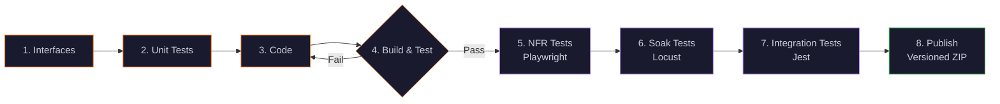
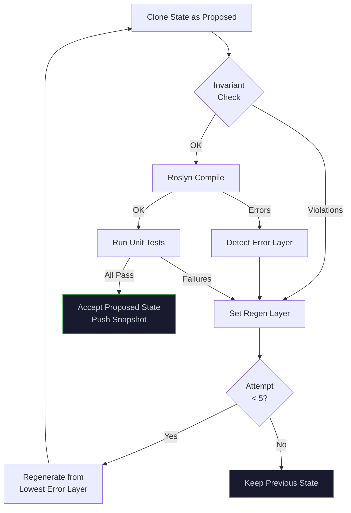

# 🔥 IdeaForge — Virtual TDD Engine

> **Describe what you want. IdeaForge generates, tests, and publishes it.**

IdeaForge is a single-file C# web application that uses LLM-driven constraint satisfaction to generate working code through a virtual TDD pipeline. Define your intent, constraints, and architecture — the engine generates interfaces, tests, code, runs them, and publishes a versioned artifact.

No scaffolding. No boilerplate. Just constraints in → working code out.

---

## ✨ Key Features

- **8-stage Forge pipeline** — Interfaces → Unit Tests → Code → Build → NFR Tests → Soak Tests → Integration Tests → Publish
- **Real-time collaboration** — SSE-based live sync across multiple browser tabs/users
- **Quick Fill presets** — One-click templates for common architectures, frameworks, and patterns
- **Versioned builds** — Semver-tracked artifacts with full build history and download
- **Google OIDC auth** — Per-user isolated sessions with sharing via token links
- **Monaco editor** — Syntax-highlighted code viewer with multi-language support
- **Single file** — The entire application is one `Program.cs` (no frameworks, no ASP.NET)

---

## 🏗 Architecture

```
┌─────────────────────────────────────────────────────┐
│                    Browser (SPA)                     │
│  ┌──────────┐  ┌──────────┐  ┌────────────────────┐│
│  │Constraint│  │  Chat /   │  │  Monaco Editor     ││
│  │  Editor  │  │  Prompt   │  │  (Code/Tests/Logs) ││
│  └────┬─────┘  └────┬─────┘  └────────┬───────────┘│
│       │              │                 │             │
│       └──────────────┼─────────────────┘             │
│                      │ SSE + REST                    │
└──────────────────────┼───────────────────────────────┘
                       │
┌──────────────────────┼───────────────────────────────┐
│              HttpListener (:5005)                     │
│  ┌───────────┐ ┌───────────┐ ┌─────────────────────┐│
│  │  Auth &   │ │  Session  │ │   Generation        ││
│  │  Users    │ │  Manager  │ │   Pipeline           ││
│  └───────────┘ └───────────┘ └──────────┬──────────┘│
│                                         │            │
│  ┌──────────────────────────────────────┤            │
│  │         Forge Engine                 │            │
│  │  ┌─────────┐ ┌────────┐ ┌────────┐ │            │
│  │  │ OpenAI  │ │ Roslyn │ │External│ │            │
│  │  │ Client  │ │Compiler│ │Runners │ │            │
│  │  └─────────┘ └────────┘ └────────┘ │            │
│  └──────────────────────────────────────┘            │
│                                                      │
│  ┌──────────────────────────────────────────────────┐│
│  │  ~/.ideaforge/                                   ││
│  │  ├── users/{sub}/sessions/{id}/store.json       ││
│  │  ├── users/{sub}/builds.json                    ││
│  │  ├── artifacts/{project}/{project}-v{ver}.zip   ││
│  │  └── shares.json                                ││
│  └──────────────────────────────────────────────────┘│
└──────────────────────────────────────────────────────┘
```

---

## 🔄 Pipeline

IdeaForge follows a 7-phase conceptual pipeline:

```
Intent → Constraints → Shape → Behaviour → Forge → Evolve → Commit
```

### Layer Model

| Phase | Layer | Description |
|-------|-------|-------------|
| **0 · Intent** | Description | What problem is being solved |
| | Personas | Actors interacting with the system |
| **1 · Constraints** | Rules | Design philosophy (pure functions, SRP, etc.) |
| | Invariants | Conditions that must always hold |
| **2 · Shape** | Architecture | System structure and decomposition |
| | Dataflow | Data movement and transformation |
| | Frameworks | Technology stack |
| | Language | Implementation language |
| **3 · Behaviour** | Features | System capabilities |
| | Stories | Functional requirements as flows |
| | NFR | Non-functional requirements |

### Forge Pipeline (8 stages)



The **Build & Test** loop retries up to 5 times with cascade regeneration — if a compilation error is detected in the test layer, it regenerates from tests upward. Only after unit tests pass do the external test stages run.

### Retry & Cascade Logic



---

## 🚀 Getting Started

### Prerequisites

- [.NET 10 SDK](https://dotnet.microsoft.com/download)
- An OpenAI API key (or compatible endpoint)

### Run

```bash
# Set your API key
export OPENAI_API_KEY="sk-..."

# Build and run
cd VirtualTDD
dotnet run
```

Open **http://localhost:5005** in your browser.

### Optional Configuration

| Environment Variable | Default | Description |
|---------------------|---------|-------------|
| `OPENAI_API_KEY` | *(required)* | OpenAI API key |
| `OPENAI_MODEL` | `gpt-4.1` | Model to use for generation |
| `OPENAI_ENDPOINT` | `https://api.openai.com/v1/chat/completions` | API endpoint |
| `GOOGLE_CLIENT_ID` | *(disabled)* | Google OAuth client ID |
| `GOOGLE_CLIENT_SECRET` | *(disabled)* | Google OAuth client secret |
| `IDEAFORGE_BASE_URL` | `http://localhost:5005` | Base URL for OAuth redirects |

Without Google credentials, auth is disabled and the app runs in open-access "local" mode.

---

## 🖥 UI Overview

The UI is split into three panels:

```
┌──────────────────────────────────────────────────────────────────┐
│ 🔥 IdeaForge    [project-name] v[0.1.0]   📦 Builds  🗂 Session │
├──────────────┬───────────────────────┬───────────────────────────┤
│              │                       │                           │
│  CONSTRAINTS │     CHAT / PROMPT     │    EDITOR TABS            │
│              │                       │                           │
│ ┌──────────┐ │  User: "Build a       │  📄 Code | 🧪 Unit |     │
│ │0 · Intent│ │   task manager"       │  🎭 NFR | 🔥 Soak |      │
│ │Description│ │                       │  🔗 Integration |        │
│ │Personas  │ │  System: ⏳ Generating │  📋 Logs | 🗂 Store      │
│ ├──────────┤ │   Interfaces...       │                           │
│ │1 · Const │ │  System: ✅ Done      │  ┌───────────────────┐   │
│ │Rules     │ │  System: 🧪 Running   │  │ using System;     │   │
│ │Invariants│ │   unit tests...       │  │ namespace App {   │   │
│ ├──────────┤ │  System: 🎉 All       │  │   public interface│   │
│ │2 · Shape │ │   tests passed!       │  │   ICalculator {   │   │
│ │Arch      │ │                       │  │     ...           │   │
│ │Dataflow  │ │  ┌─────────────────┐  │  └───────────────────┘   │
│ │Frameworks│ │  │ 📝 Type prompt  │  │                           │
│ │Language  │ │  │ 🔥 Generate     │  │  ─────────────────────── │
│ ├──────────┤ │  └─────────────────┘  │  🧪 Unit: ✅              │
│ │3 · Behav │ │                       │  🎭 NFR: ✅               │
│ │Features  │ │  📜 History           │  🔥 Soak: ✅              │
│ │Stories   │ │  #3 All tests passed  │  🔗 Int: ✅               │
│ │NFR       │ │  #2 Before generation │  📦 my-app-v0.1.0.zip    │
│ └──────────┘ │  #1 Initial           │                           │
├──────────────┴───────────────────────┴───────────────────────────┤
│ Each constraint layer has a 📋 Quick Fill button for presets     │
└──────────────────────────────────────────────────────────────────┘
```

### Editor Tabs

| Tab | Content | Language |
|-----|---------|----------|
| 📄 **Code** | Full assembled C# source | C# |
| 🧪 **Unit** | Generated unit test code | C# |
| 🎭 **NFR** | Playwright test code | TypeScript |
| 🔥 **Soak** | Locust load test code | Python |
| 🔗 **Integration** | Jest integration tests | TypeScript |
| 📋 **Logs** | Real-time test runner output | Plain text |
| 🗂 **Store** | File browser for all layers | Mixed |

---

## 📦 Build Artifacts

Each successful Forge run publishes a versioned ZIP:

```
~/.ideaforge/artifacts/my-project/
├── my-project-v0.1.0.zip
├── my-project-v0.1.1.zip
└── my-project-v0.2.0.zip
```

Each ZIP contains:

```
my-project-v0.1.0/
├── SPEC.md              # Full pipeline specification
├── constraints.json     # All layer constraints as JSON
├── generated.cs         # Complete assembled source
├── src/
│   ├── interface-*.cs   # Individual interfaces
│   ├── impl-*.cs        # Individual implementations
│   └── test-*.cs        # Unit test code
└── tests/
    ├── nfr-tests.spec.ts    # Playwright tests
    ├── locustfile.py         # Locust load tests
    └── integration.test.ts   # Jest tests
```

Version auto-increments (patch) after each publish. Browse and download all builds from the **📦 Builds** flyout in the header.

---

## 🔌 API Reference

### State & Generation

| Method | Path | Description |
|--------|------|-------------|
| `GET` | `/api/state` | Full system state (all layers) |
| `POST` | `/api/state` | Update constraints (merge) |
| `POST` | `/api/prompt` | Submit prompt → start generation |
| `GET` | `/api/code` | Current generated source |
| `GET` | `/api/generating` | Generation in progress? |

### History & Snapshots

| Method | Path | Description |
|--------|------|-------------|
| `GET` | `/api/history` | List all state snapshots |
| `POST` | `/api/revert` | Revert to snapshot by index |
| `GET` | `/api/chat` | Full chat log |

### Sessions

| Method | Path | Description |
|--------|------|-------------|
| `GET` | `/api/sessions` | List user sessions |
| `POST` | `/api/sessions` | Create new session |
| `POST` | `/api/sessions/switch` | Switch active session |
| `POST` | `/api/sessions/rename` | Rename a session |
| `POST` | `/api/sessions/delete/{id}` | Delete a session |
| `POST` | `/api/sessions/share` | Generate share token |

### Store & Builds

| Method | Path | Description |
|--------|------|-------------|
| `GET` | `/api/store/tree` | Layer/file tree |
| `GET` | `/api/store/file?layer=X&key=Y` | File content |
| `POST` | `/api/commit` | Save state to disk |
| `GET` | `/api/builds` | List all builds |
| `GET` | `/api/builds/download/{file}` | Download build ZIP |

### SSE (Server-Sent Events)

| Event | Payload | Description |
|-------|---------|-------------|
| `full-sync` | Complete state + code | Initial connection sync |
| `state` | Constraint deltas | Real-time constraint updates |
| `chat` | `{ role, message }` | Chat/log entries |
| `code` | `{ code }` | Source code updates |
| `generating` | `{ generating }` | Pipeline status |
| `test-result` | `{ category, runner, exitCode, output }` | Test runner results |
| `artifact` | `{ fileName, version }` | Build published |
| `ping` | `{ clients }` | Heartbeat + client count |

---

## 🧠 How It Works

IdeaForge treats code generation as **constraint satisfaction**, not instruction execution.

1. **You define constraints** across 4 groups (Intent, Constraints, Shape, Behaviour)
2. **The LLM resolves** a system that satisfies all constraints
3. **Tests derive from** Stories and Invariants
4. **A dual-state model** (`current` vs `proposed`) ensures atomicity — changes only commit when all tests pass
5. **External test runners** (Playwright, Locust, Jest) validate beyond unit tests
6. **Versioned artifacts** capture everything needed to recreate the system

The mental model: *You are not writing code. You are resolving a system that satisfies all defined constraints.*

---

## 🤝 Collaboration

With SSE-based real-time sync:

1. **Open the same session** in multiple tabs — changes sync instantly
2. **Share via token** — click 🔗 Share to generate a link
3. **Shared sessions are live** — collaborators work on the same state, not a copy
4. **Client deduplication** — mutations broadcast to all clients except the originator

---

## 📋 Quick Fill Presets

Every constraint layer has a **📋 Quick Fill** button with curated presets:

| Category | Examples |
|----------|----------|
| **Description** | E-commerce, Task Manager, Chat App, Analytics, Booking |
| **Personas** | Admin/User, Multi-role SaaS, Marketplace, Developer Platform |
| **Rules** | Pure Functions, SRP, Immutability, TDD First, DI |
| **Architecture** | Clean/Layered, Hexagonal, Event-Driven, CQRS, Microservices |
| **Dataflow** | Request-Response, Message Queue, Pub/Sub, Stream, ETL |
| **Frameworks** | React+Node, Angular+.NET, FastAPI, Spring Boot, Rust, Go |
| **Language** | TypeScript, C#, Python, Java, Rust, Go |
| **NFR** | Performance, Security, Accessibility, Scalability, Observability |
| **Invariants** | No Reflection, No File I/O, Typed IDs, No Null Returns |
| **Stories** | Auth, CRUD, Search, Notifications, Collaboration |
| **Features** | Authentication, Dashboard, Search, Messaging, CRUD |

---

## 📄 License

MIT

---

*Built with 🔥 by the IdeaForge team*
