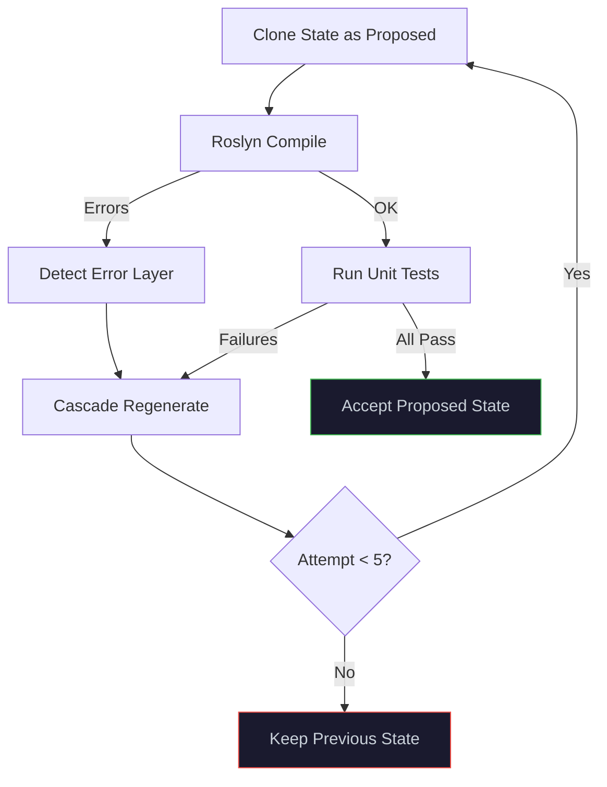

# Ψ PlatinumForge by WaveFunctionLabs

> **One idea. Eight agents. Nine stages. Working software.**

PlatinumForge is a single-file C# web application (~6500 lines) that drives LLM-powered autonomous software generation from a single idea sentence. An 8-agent Design Council helps you refine constraints, then a 9-stage linear forge pipeline generates a multi-file project with full constraint traceability — from idea to shipped artifact.

No scaffolding. No boilerplate. Idea in → traceable, validated, working code out.

**Live:** [platinumforge.wavefunctionlabs.com](https://platinumforge.wavefunctionlabs.com)

---

## ✨ Key Features

- **🏛️ 8-Agent Design Council** — Zeus, Thor, Apollo, Prometheus, Hephaestus, Themis, Hestia, and Psi collaborate on your spec
- **9-Stage Linear Forge** — Seed → Expansion → ConstraintForge → BehaviourForge → ShapeForge → BuildForge → GenerateForge → Validate → Ship
- **Constraint traceability** — Every constraint gets a unique ID (C001, C002...) traced through acceptance criteria, architecture decisions, and tests
- **Tests before code** — BuildForge generates all tests BEFORE GenerateForge writes code
- **Linear wizard UI** — Step-by-step guided flow with council suggestions at each stage
- **Council auto-suggest** — "Ask Council 🏛️" at any stage and all 8 agents propose items as checkboxes
- **Multi-file generation** — LLM plans a file manifest, then generates individual files (interfaces, services, controllers, models, Program.cs, etc.)
- **End-to-end build** — Generates .csproj, runs `dotnet build`, launches app, health-checks it
- **Structured validation** — Compilation + test execution + constraint verification + architecture conformance
- **Real-time collaboration** — SSE-based live sync across multiple browser tabs/users
- **Quality sliders** — 12 dials (performance, security, readability, etc.) that shape generated code
- **Versioned builds** — Semver-tracked artifacts with full build history and download
- **Multi-provider OAuth** — Google, Microsoft, GitHub, Facebook, Apple (or open-access local mode)
- **Monaco editor** — Syntax-highlighted code viewer with multi-language support
- **Single file** — The entire application is one `Program.cs` (~6500 lines, no frameworks, no ASP.NET)

---

## 🏛️ Design Council — 8 AI Agents

PlatinumForge features a council of 8 AI agents, each with a unique perspective. Select an agent in the chat panel and they respond in character, with full awareness of your project's materialised metadata.

| Agent | Role | Perspective |
|-------|------|-------------|
| **Ψ Psi** | General Designer | Balanced, helpful, opinionated — the default conversational agent |
| **☀️ Apollo** | The Expander | Broadens possibility — wild ideas, lateral thinking, "what if?" |
| **🔥 Prometheus** | The Challenger | Questions and challenges — probes assumptions, finds gaps |
| **⚒️ Hephaestus** | The Builder | Practical engineering — data structures, patterns, architecture, DI |
| **⚖️ Themis** | The Enforcer | Enforces rules and consistency — blocks non-compliant changes |
| **🏠 Hestia** | The Explorer | Enriches concepts — splits compound ideas, adds missing considerations |
| **⚡ Zeus** | The Arbiter | Resolves disagreements — overrides vetoes, makes final decisions when agents can't agree |
| **🔨 Thor** | The Stress Tester | Execution physics — chaos engineering, performance bottlenecks, security under stress |

Every agent can propose **actions** (add/remove/update entries in any layer) via the chat panel.

The council participates at two key points:
1. **Suggestion** — "Ask Council 🏛️" at any wizard stage fires all 8 agents to suggest items
2. **Review gates** — After each pipeline stage, all agents review output with APPROVE / CONCERN / VETO

---

## 🏗 Architecture

```
┌─────────────────────────────────────────────────────────────────────────┐
│                          Browser (SPA)                                  │
│  ┌──────────┐  ┌─────────────────────────┐  ┌────────────────────────┐ │
│  │Constraint│  │    Monaco Editor         │  │   Ψ Chat Panel         │ │
│  │  Editor  │  │  (Code/Tests/Store/Logs) │  │  Agent Tabs + Prompt   │ │
│  └────┬─────┘  └────────┬────────────────┘  └──────────┬─────────────┘ │
│       └─────────────────┼───────────────────────────────┘               │
│                         │ SSE + REST                                    │
└─────────────────────────┼──────────────────────────────────────────────┘
                          │
┌─────────────────────────┼──────────────────────────────────────────────┐
│              HttpListener (:5005)                                       │
│  ┌───────────┐ ┌───────────┐ ┌─────────────────────┐ ┌──────────────┐ │
│  │  Auth &   │ │  Session  │ │   Generation        │ │  Agent       │ │
│  │  Users    │ │  Manager  │ │   Pipeline          │ │  Router      │ │
│  └───────────┘ └───────────┘ └──────────┬──────────┘ └──────────────┘ │
│                                         │                              │
│  ┌──────────────────────────────────────┤                              │
│  │         Forge Engine                 │                              │
│  │  ┌─────────┐ ┌────────┐ ┌────────┐  │                              │
│  │  │ OpenAI  │ │ Roslyn │ │External│  │                              │
│  │  │ Client  │ │Compiler│ │Runners │  │                              │
│  │  └─────────┘ └────────┘ └────────┘  │                              │
│  └──────────────────────────────────────┘                              │
│                                                                        │
│  ┌────────────────────────────────────────────────────────────────────┐│
│  │  ~/.platinumforge/                                                 ││
│  │  ├── users/{sub}/sessions/{id}/store.json                         ││
│  │  ├── users/{sub}/builds.json                                      ││
│  │  ├── artifacts/{project}/{project}-v{ver}.zip                     ││
│  │  └── shares.json                                                  ││
│  └────────────────────────────────────────────────────────────────────┘│
└────────────────────────────────────────────────────────────────────────┘
```

---

## 🔄 9-Stage Linear Forge Pipeline

```
Seed → Expansion → ConstraintForge → BehaviourForge → ShapeForge → BuildForge → GenerateForge → Validate → Ship
```

### Stage Model

| # | Stage | Purpose | Fields |
|---|-------|---------|--------|
| **1** | 🌱 **Seed** | Capture the raw idea | `idea` (string), `description` (string) |
| **2** | 💡 **Expansion** | Interpret & expand the idea | `interpretations[]`, `personas[]` (exploratory), `personaLineage[]` |
| **3** | ⚖️ **ConstraintForge** | Single source of truth for ALL constraints | `personas[]`, `rules[]`, `invariants[]`, `nfr[]`, `quality[]` + `constraintRegistry` (C001, C002...) |
| **4** | 🎭 **BehaviourForge** | Define what the system must do | `features[]`, `stories[]`, `acceptanceCriteria[]` (with constraint refs) |
| **5** | 🏗️ **ShapeForge** | Define how it will exist | `architecture`, `dataflow`, `frameworksAndTools`, `language`, `deploymentModel` (with constraint refs) |
| **6** | 🧪 **BuildForge** | Tests FIRST — proof before generation | `unitTests[]`, `integrationTests[]`, `e2eTests[]`, `soakTests[]` (with constraint refs) |
| **7** | ⚒️ **GenerateForge** | Generate the system | `fileManifest[]`, `interfaces`, `code`, `projectFiles` |
| **8** | ✓ **Validate** | Ensure system is valid | compilation, testExecution, constraintVerification, architectureConformance |
| **9** | 🚀 **Ship** | Output result | Publish versioned artifact or deploy |

### Constraint Traceability

Every constraint registered in ConstraintForge gets a unique ID (C001, C002...). These IDs are traced through the entire pipeline:

```
ConstraintForge (C001: "rule:no-sql-injection")
  → BehaviourForge: acceptanceCriteria["input-validation"] refs [C001]
  → ShapeForge: architecture["input-sanitisation-layer"] refs [C001]
  → BuildForge: testConstraints["sql-injection-test"] refs [C001]
  → Validate: constraintVerification checks C001 has test + AC coverage
```

Nothing behaves, exists, or ships without traceable constraint lineage.

### Council Review Gates

After each pipeline stage, all 8 agents review the output:
- **APPROVE** — output looks good, proceed
- **CONCERN** — minor issues, OK to proceed
- **VETO** — critical problem, pipeline pauses (Zeus can override)

### Validation Categories

The Validate stage checks four dimensions:
1. **Compilation** — Roslyn in-memory + `dotnet build`
2. **Test Execution** — Unit tests must pass
3. **Constraint Verification** — Every registered constraint must have test or AC coverage
4. **Architecture Conformance** — Every architecture decision must trace to constraints

Failures produce structured output: `{ stage, type, constraintId, message }`

### Build & Test Retry Logic



---

## 🚀 Getting Started

### Prerequisites

- [.NET 10 SDK](https://dotnet.microsoft.com/download)
- An OpenAI API key (or compatible endpoint)

### Run

```bash
# Set your API key
export OPENAI_API_KEY="sk-..."

# Build and run
cd PlatinumForge
dotnet run
```

Open **http://localhost:5005** in your browser.

### Optional Configuration

| Environment Variable | Default | Description |
|---------------------|---------|-------------|
| `OPENAI_API_KEY` | *(required)* | OpenAI API key |
| `OPENAI_MODEL` | `gpt-4.1` | Model to use for generation |
| `OPENAI_ENDPOINT` | `https://api.openai.com/v1/chat/completions` | API endpoint |
| `GOOGLE_CLIENT_ID` | *(disabled)* | Google OAuth client ID |
| `GOOGLE_CLIENT_SECRET` | *(disabled)* | Google OAuth client secret |
| `MICROSOFT_CLIENT_ID` | *(disabled)* | Microsoft / Entra ID OAuth client ID |
| `MICROSOFT_CLIENT_SECRET` | *(disabled)* | Microsoft / Entra ID OAuth client secret |
| `GITHUB_CLIENT_ID` | *(disabled)* | GitHub OAuth App client ID |
| `GITHUB_CLIENT_SECRET` | *(disabled)* | GitHub OAuth App client secret |
| `FACEBOOK_CLIENT_ID` | *(disabled)* | Facebook OAuth App ID |
| `FACEBOOK_CLIENT_SECRET` | *(disabled)* | Facebook OAuth App secret |
| `APPLE_CLIENT_ID` | *(disabled)* | Apple Services ID |
| `APPLE_CLIENT_SECRET` | *(disabled)* | Apple client secret (pre-generated JWT) |
| `PLATINUMFORGE_DATA_DIR` | `~/.platinumforge` | Root directory for all persistent data |
| `PLATINUMFORGE_BASE_URL` | `http://localhost:5005` | Base URL for OAuth redirects |

Configure one or more OAuth providers to enable sign-in. Without any credentials, auth is disabled and the app runs in open-access "local" mode.

---

## 🖥 UI Overview

The UI is a 3-panel layout with a linear wizard:

```
┌──────────────────────────────────────────────────────────────────────────────┐
│ Ψ PlatinumForge   [project-name] v[0.1.0]  📦 Builds  📤 📥  🗂 Session  💾│
├────────────┬─────────────────────────────────┬───────────────────────────────┤
│            │                                 │ Ψ Agents — Design Council    │
│   WIZARD   │    EDITOR TABS                  │ (420px, collapsible)         │
│            │                                 │ [Ψ] [☀️] [🔥] [⚒️]          │
│ ┌────────┐ │ 📄 Code | 🧪 Unit | 🎭 E2E |  │ [⚖️] [🏠] [⚡] [🔨]        │
│ │Step Bar│ │ 🌊 Soak | 🔗 Int | 📋 Logs |  │─────────────────────────────│
│ │🌱💡⚖️🎭│ │ 🗂 Store                        │ Agent cards with avatars,   │
│ │🏗️🧪⚒️✓🚀│ │                                 │ names, roles, mood dots     │
│ ├────────┤ │ ┌─────────────────────────────┐ │                              │
│ │        │ │ │  📁 Store Files             │ │ ☀️ Apollo — The Expander    │
│ │ Stage  │ │ │  🔌 Interfaces              │ │ 🟢 ready                    │
│ │Content │ │ │    📄 IUserService.cs       │ │ What if you added a real-   │
│ │        │ │ │  💻 Services                │ │ time collaboration engine?  │
│ │Suggest │ │ │    📄 UserService.cs        │ │                              │
│ │ items  │ │ │  🚀 Startup                 │ │ ▶ Add feature               │
│ │as ☑️   │ │ │    📄 Program.cs            │ │                              │
│ │        │ │ │  🧪 Unit Tests              │ │ [Constraint C003 badge]     │
│ ├────────┤ │ └─────────────────────────────┘ │                              │
│ │◀ Back  │ │                                 │─────────────────────────────│
│ │🏛️ Ask  │ │                                 │ [Ask Psi...]                 │
│ │Next ▶  │ │                                 │ [Ψ Send] [🔥 Generate] [↻]  │
│ └────────┘ │                                 │                              │
├────────────┴─────────────────────────────────┴──────────────────────────────┤
│ 🌱 Seed ▶ 💡 Expand ▶ ⚖️ Constrain ▶ 🎭 Behave ▶ 🏗️ Shape ▶ ... ▶ 🚀 Ship│
│ [████████████████████░░░░░░░░░] Stage 7/9: GenerateForge — 24.1s           │
└──────────────────────────────────────────────────────────────────────────────┘
```

### Left Panel — Linear Wizard (9 steps)
- **Step indicator bar** at top showing all 9 stages with active/done/pending states
- One stage visible at a time with contextual content:
  - **Seed**: Text input for idea + description
  - **Expansion**: Radio cards to pick from 3 council-expanded descriptions
  - **ConstraintForge–ShapeForge**: Checkbox lists of council suggestions + custom add
  - **BuildForge–Ship**: "▶ Run" buttons to execute pipeline stages
- **🏛️ Ask Council** button fires all 8 agents to suggest items
- **◀ Back** / **Save & Next ▶** navigation
- Constraint ID badges (C001, C002...) on items in constraint stages
- Agent avatar badges showing which agent suggested each item

### Centre Panel — Editor
- Monaco editor with syntax highlighting
- Tabs: Code, Unit Tests, E2E Tests, Soak Tests, Integration Tests, Logs, Store
- **Store** tab shows the generated file tree grouped by category

### Right Panel — Chat (Ψ Agents, 420px, hideable)
- Collapsible via ✕ button, reopens with Ψ edge button
- 8 agent tabs wrapping to two rows
- Agent cards: avatar icon + name + role subtitle + mood indicator dot
- Mood states: 🟢 ready, 🟡 thinking (pulsing), 🔴 vetoed
- Action buttons (▶) to apply suggested changes
- Prompt input with Send, Generate, and Regen buttons

---

## 📦 Build Artifacts

Each successful Ship stage publishes a versioned ZIP:

```
~/.platinumforge/artifacts/my-project/
├── my-project-v0.1.0.zip
├── my-project-v0.1.1.zip
└── my-project-v0.2.0.zip
```

Each ZIP contains:

```
my-project-v0.1.0/
├── SPEC.md                        # Full pipeline specification
├── constraints.json               # All constraints with IDs (C001...)
├── generated.cs                   # Complete assembled source (for Roslyn)
├── src/
│   ├── Interfaces/
│   │   └── IUserService.cs
│   ├── Services/
│   │   └── UserService.cs
│   ├── Controllers/
│   │   └── UserController.cs
│   ├── Models/
│   │   └── UserDto.cs
│   └── Startup/
│       └── Program.cs
├── tests/
│   ├── unit/                      # Roslyn-compiled C# tests
│   ├── e2e-tests.spec.ts          # Playwright tests
│   ├── locustfile.py              # Locust load tests
│   └── integration.test.ts        # Jest tests
└── project/
    ├── *.csproj
    └── build-config.json          # Build/run/health-check commands
```

---

## 🔌 API Reference

### State & Generation

| Method | Path | Description |
|--------|------|-------------|
| `GET` | `/api/state` | Full system state (all stages) |
| `POST` | `/api/state` | Update constraints (merge) |
| `POST` | `/api/prompt` | Submit prompt → start full pipeline |
| `POST` | `/api/pipeline/step` | Run a single stage (`{ stage }`) |
| `GET` | `/api/code` | Current generated source |
| `GET` | `/api/generating` | Generation in progress? |

### Council & Constraints

| Method | Path | Description |
|--------|------|-------------|
| `POST` | `/api/council/suggest` | Ask council to suggest items for a stage (`{ stage }`) |
| `POST` | `/api/constraints/register` | Register a constraint, get ID (`{ type, key }` → `{ constraintId: "C001" }`) |

### Chat & Agents

| Method | Path | Description |
|--------|------|-------------|
| `POST` | `/api/chat/send` | Send message to agent (`{ message, agent }`) |
| `POST` | `/api/chat/apply` | Apply a proposed action by ID |
| `GET` | `/api/chat` | Full chat log |
| `POST` | `/api/enrich` | Hestia enrichment (`{ layer, isString }`) |
| `POST` | `/api/dedupe` | LLM deduplication (`{ layer }`) |

### History & Snapshots

| Method | Path | Description |
|--------|------|-------------|
| `GET` | `/api/history` | List all state snapshots |
| `POST` | `/api/revert` | Revert to snapshot by index |

### Sessions

| Method | Path | Description |
|--------|------|-------------|
| `GET` | `/api/sessions` | List user sessions |
| `POST` | `/api/sessions` | Create new session |
| `POST` | `/api/sessions/switch` | Switch active session |
| `POST` | `/api/sessions/rename` | Rename a session |
| `POST` | `/api/sessions/delete/{id}` | Delete a session |
| `POST` | `/api/sessions/share` | Generate share token |

### Store & Builds

| Method | Path | Description |
|--------|------|-------------|
| `GET` | `/api/store/tree` | File tree (grouped by category) |
| `GET` | `/api/store/file?layer=X&key=Y` | File content |
| `POST` | `/api/commit` | Save state to disk |
| `GET` | `/api/builds` | List all builds |
| `GET` | `/api/builds/download/{file}` | Download build ZIP |

### SSE (Server-Sent Events)

| Event | Payload | Description |
|-------|---------|-------------|
| `full-sync` | Complete state + code | Initial connection sync |
| `state` | Constraint deltas | Real-time constraint updates |
| `chat` | `{ role, message, actions }` | Chat entries (role = agent name) |
| `code` | `{ code }` | Source code updates |
| `generating` | `{ generating }` | Pipeline status |
| `progress` | `{ stage, total, name, status, detail }` | Pipeline stage progress |
| `pipeline-vetoed` | `{ stage, agent, message }` | Council veto halts pipeline |
| `validation-results` | `{ failures: [{ stage, type, constraintId, message }] }` | Structured validation output |
| `stage-complete` | `{ stage, status, reviews }` | Stage + council review results |
| `test-result` | `{ category, runner, exitCode, output }` | Test runner results |
| `artifact` | `{ fileName, version }` | Build published |
| `pipeline-complete` | `{ success, projectName, elapsed }` | Pipeline finished (triggers browser notification) |
| `ping` | `{ clients }` | Heartbeat + client count |

---

## 🧠 How It Works

PlatinumForge treats code generation as **constraint satisfaction with full traceability**, not instruction execution.

1. **You enter an idea** — one sentence in the Seed stage
2. **The council expands it** — 3 agents generate expanded descriptions, you pick one
3. **You define constraints** — guided by the wizard, with council suggestions at every step
4. **Every constraint gets an ID** — C001, C002... tracked through the entire pipeline
5. **Tests are generated FIRST** — BuildForge creates tests before any code exists
6. **Code is generated to satisfy tests** — GenerateForge produces interfaces, implementations, project files
7. **Structured validation** — compilation, test execution, constraint verification, architecture conformance
8. **Council reviews every stage** — 8 agents vote APPROVE/CONCERN/VETO
9. **Ship** — versioned artifact with full constraint traceability

The mental model: *You are not writing code. You are resolving a system where every constraint has a unique ID, every architecture decision traces to constraints, every test proves constraints, and nothing ships without full lineage.*

---

## 🤝 Collaboration

With SSE-based real-time sync:

1. **Open the same session** in multiple tabs — changes sync instantly
2. **Share via token** — click 🔗 Share to generate a link
3. **Background sync** — 10-second interval keeps all clients in sync
4. **Client deduplication** — mutations broadcast to all clients except the originator

---

## 📋 Quick Fill Presets

Every constraint layer has a **📋 Quick Fill** button with curated presets:

| Category | Examples |
|----------|----------|
| **Description** | E-commerce, Task Manager, Chat App, Analytics, Booking |
| **Personas** | Admin/User, Multi-role SaaS, Marketplace, Developer Platform |
| **Rules** | Pure Functions, SRP, Immutability, TDD First, DI |
| **Architecture** | Clean/Layered, Hexagonal, Event-Driven, CQRS, Microservices |
| **Dataflow** | Request-Response, Message Queue, Pub/Sub, Stream, ETL |
| **Frameworks** | React+Node, Angular+.NET, FastAPI, Spring Boot, Rust, Go |
| **Language** | TypeScript, C#, Python, Java, Rust, Go |
| **NFR** | Performance, Security, Accessibility, Scalability, Observability |
| **Invariants** | No Reflection, No File I/O, Typed IDs, No Null Returns |
| **Stories** | Auth, CRUD, Search, Notifications, Collaboration |
| **Features** | Authentication, Dashboard, Search, Messaging, CRUD |

---

## 📄 License

MIT

---

*Built with Ψ by WaveFunctionLabs*
